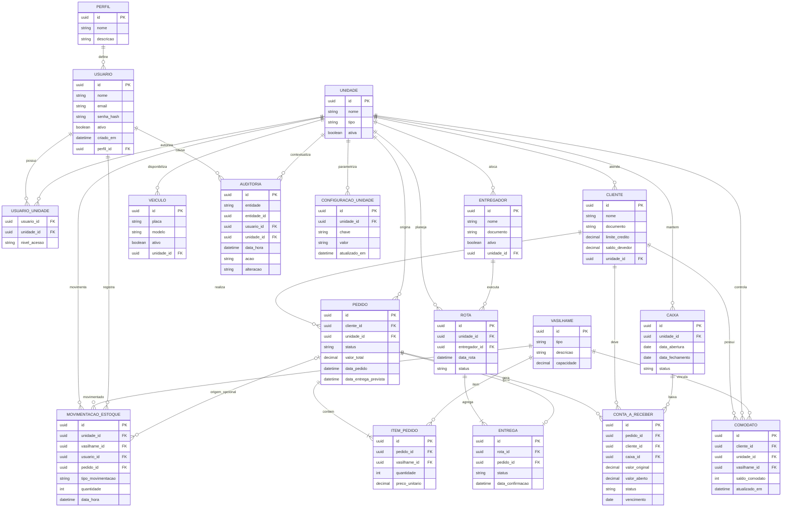

# Diagrama Entidade-Relacionamento (DER) - GasStation

Este DER foi elaborado com base no estado atual do `docs/DDE Samuel.txt`, especialmente na secao `3.1.1 Entidade-Relacionamento`.

Observacoes:
- O diagrama representa a visao conceitual inicial do dominio, derivada da documentacao.
- Atributos e cardinalidades podem ser refinados durante a implementacao do DEM completo e do DDL.
